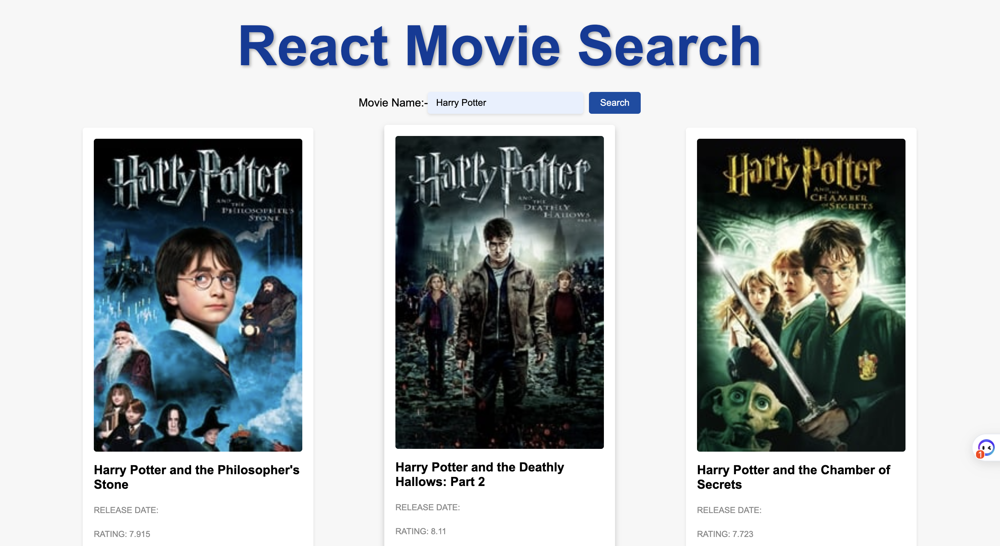

# Movie App

The Movie App is a web application that allows users to search for movies and view detailed information about them. The app utilizes the TMDB API to fetch movie data and displays it in a user-friendly interface.



## Features

- Search for movies by entering a movie name in the search bar
- Display search results as a list of movie cards, including movie title, release date, rating, and poster image
- Responsive design to ensure a seamless experience across devices

## Technologies Used
- React: A JavaScript library for building user interfaces
- TMDB API: A free and community-driven movie database API

## Getting Started

To run the Movie App locally on your machine, follow these steps:
***
1. Clone the repository:
```
(https://github.com/your-username/movie-app.git)
```

2. Install the dependencies:
```
$cd movie-app
$npm install
```

3. Obtain an API key from the TMDB website by creating an account and requesting an API key.

4. Then chage api key in Serachmovie.js file at line no. 13 in place of your_api


5. Start the development server:
```
$npm start
```


6. Open your browser and navigate to `http://localhost:3000` to view the app.

## Contributing

Contributions are welcome! If you find any bugs or have suggestions for improvements, please open an issue or submit a pull request.


## Acknowledgments

- The Movie Database (TMDB) for providing the movie data and API access.


